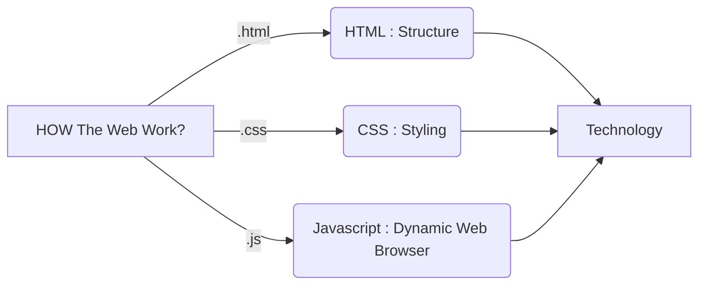

# 100 Days Of Code Challenge by Academinds!

Assamualaikum warhamatullah Wabarakatuh

Helloo :)

This Repo Is about My Journey 100 Days Challenge Web Development

# Day 1

In This Day Learn About Basic HTML Extension

> 1. How The Web Work
> 2. Write Plain Text and change it into .html
> 3. Say Salam to First Web World
> 4. Then It Show

This Pict will Show glimpse of It:

