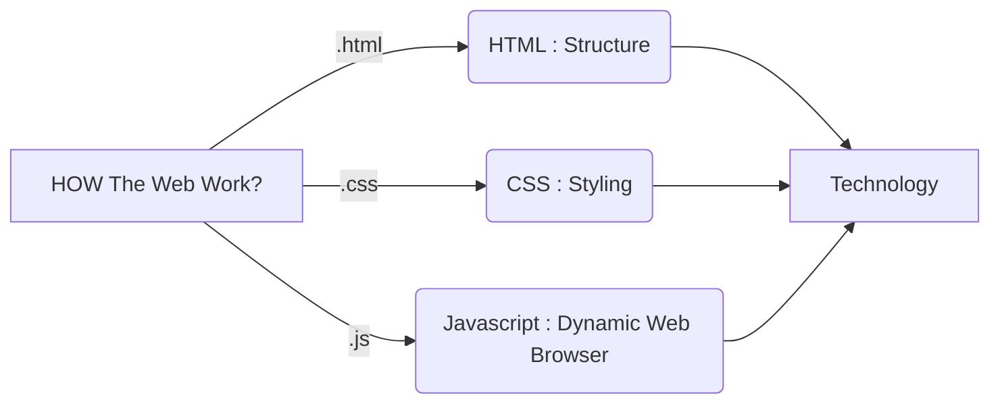
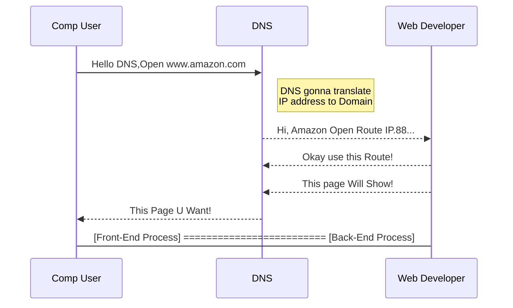
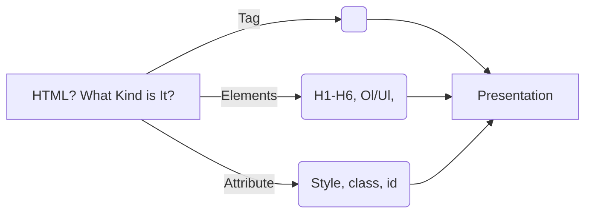
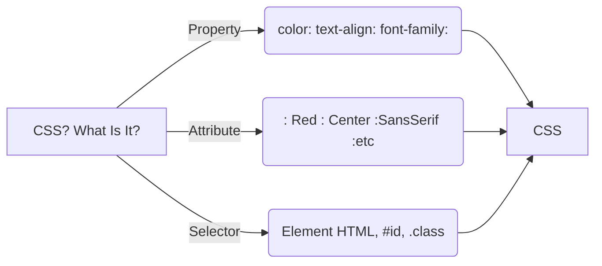
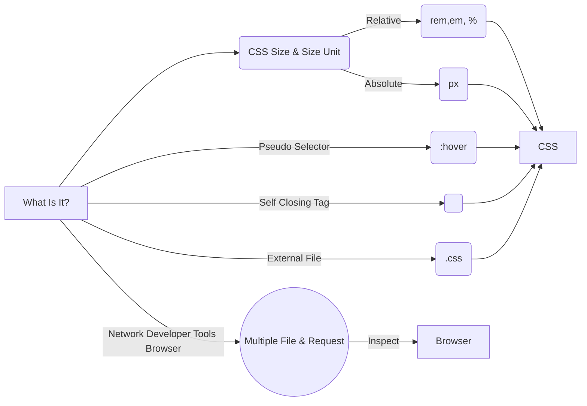

# 100 Days Of Code Challenge by Academinds!
Assamualaikum warhamatullah Wabarakatuh
Helloo :) **I'm Muhammad Fajri Assiddiq**
This Repo Is about My Journey 100 Days Challenge Web Development
## Day 1
In This Day Learn About Basic How The Web Work
>  1. How The Web Work
>  2. Technology Behind it
>  3. HTML CSS and JavaScript
>  4. IP Address: Response and Request

This Pict will Show glimpse of It:

## Day 2
In This Day Learn About HTML
>  1. What Is HTMl
>  2. Write Plain Text and change it into .html
>  3. Say Salam to First Web World
>  4. Then It Show

This Pict will Show glimpse of It:

## Day 3
In This Day Learn About:
>  1. CSS Inline - Internal
>  2. VSCode & Extension
>  3. CSS Property & Attribut
>  4. CSS Selector
>  5. HTML Structure 

This Pict will Show glimpse of It:

## Day 4
In This Day Learn About:
>  1. CSS External
>  2. CSS Pseudo Selector
>  3. Network at Developer tools Browser
>  4. Void Element < Self Closing Tag/>
>  5. HTML Structure 

This Pict will Show glimpse of It:
